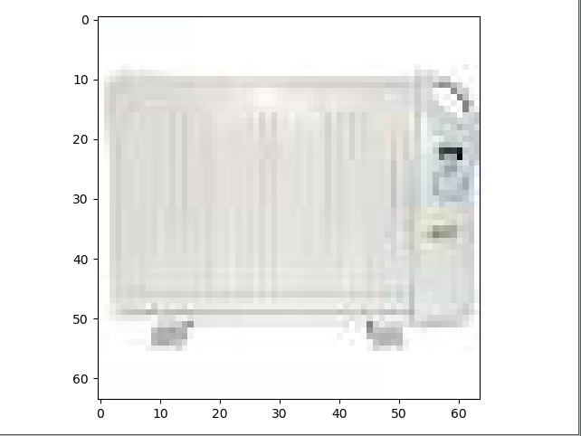
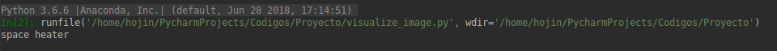
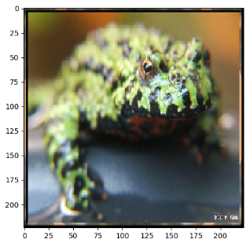
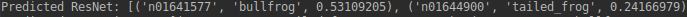
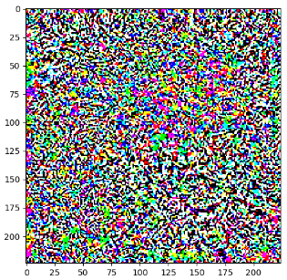
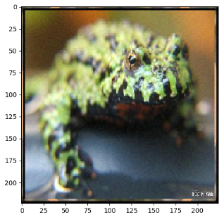
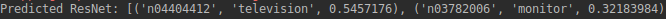
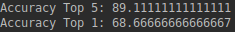
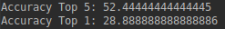

# Proyecto EL-4106: Defensa Adversaria

#### Members: Hojin Kang y Tomás Nuñez

## Codes in the repository

#### Tools
<pre>
Scripts that have the tools required for the evaluation

adv_example_generation.py   --  Has all the scripts needed to generate adversarial
                                examples and visualize them, whether individually
                                or in batches. Also can save the adversarial examples.

evaluate.py                 --  Has the functions necessary to evaluate the Accuracy
                                of the models in a given dataset.
                                                                
load_single_imagenet.py     --  Has various scripts to load images from the ImageNet
                                dataset. Also has the processing of images.
                                
single_image.py             --  To return a single resized image and its tag.

</pre>

#### Scripts

<pre>
Scripts that have the implementation using the Tools

evaluate_adversarial.py     --  Evaluates the model with the adversarial examples.

evaluate_results.py         --  Evaluates the model with the original images.

preimplemented_imagenet.py  --  Sample for generating a single adversarial example.
                                Gets the original image and its prediction, and
                                compares it to the filtered image and its predictions.

test_imagenes.py            --  Generates the adversarial examples.
          
visualize_image.py          --  Visualize a single image (resized) and its tag 
                                (doesn't load all images)
</pre>
## Instructions

For simple generation and visualization of adversary examples use <i>preimplemented_imagenet.py</i>.
Adjust the value of <i>n</i> to get different images.

<b>NOTE:</b> Change the paths in lines 15 and 16 of <i>load_single_imagenet.py</i> to the
correct path of the file containing the words and the file containing the link to the images
respectively.
## Example case for image visualization

## Example case for adversarial example

#### Original image and prediction

#### Filter for Adversarial Example

#### Adversarial image and prediction

## Results obtained with FGSM

#### Accuracy for original images

#### Accuracy for adversarial examples

