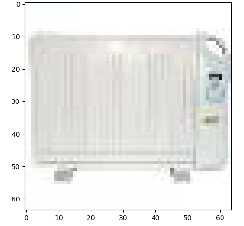

# Proyecto EL-4106

<pre>
adv_example_generation.py   --  Has all the scripts needed to generate adversarial
                                examples and visualize them.
                                
load_images.py              --  Loads images

load_images_PIL.py          --  Loads images in PIL format

load_single_imagenet.py     --  Loads a single image from the ImageNet library and
                                gives its tag and identifier. Image is loaded in
                                PIL format.
                                
preimplemented_imagenet.py  --  Sample for generating a single adversarial example.
                                Gets the original image and its prediction, and
                                compares it to the filtered image and its predictiong.
                                
single_image.py             --  To return a single resized image and its tag

visualize_image.py          --  Visualize a single image (resized) and its tag 
                                (doesn't load all images)
</pre>

## Example case for image visualization

## Example case for adversarial example

#### Original image and prediction

#### Filter for Adversarial Example

#### Adversarial image and prediction

